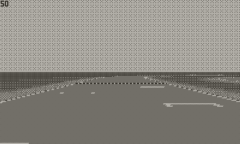
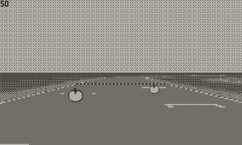
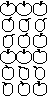

## Playdate Mode7 Help

Hello RPDev, thank you for taking the time to check this out. I really appreciate your help.

Below are the code examples I have added for this MVP of help.

Example 1 is based on the calculation you shared in Discord.

Example 2 is based on nothing. I just put in random values until it got _close_ to what I expected to see.

RPDev says:

"scale should be 39, the calc is (max - min) / step + 1. Rotation is 18 based on your spritesheet"


Results: This causes the apples to only be visible from one side and then when you get close, the apples start getting big then small then big then small


```
dataSource:setMinimumWidth(8)
dataSource:setMaximumWidth(160)
dataSource:setLengthForKey(39, mode7.sprite.datasource.kScale)
dataSource:setLengthForKey(18, mode7.sprite.datasource.kAngle)
```

This one is the closest to what I would expect, but it still is not right. The angles don't render and the sprite disappears when the camera gets close


```
dataSource:setMinimumWidth(8)
dataSource:setMaximumWidth(64) -- I changed this to 64 and it looks better. Random!!
dataSource:setLengthForKey(14, mode7.sprite.datasource.kScale) -- 14 is a random number that just happened to look good
-- dataSource:setLengthForKey(18, mode7.sprite.datasource.kAngle)
```

My original 17 frames spritesheet can be found in `Source/images/apple-table-16-16`

